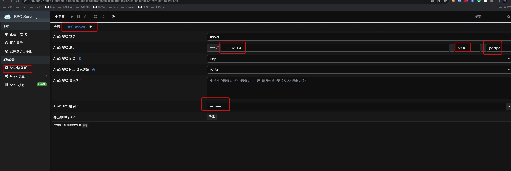
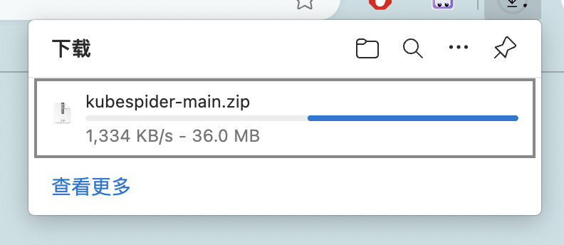
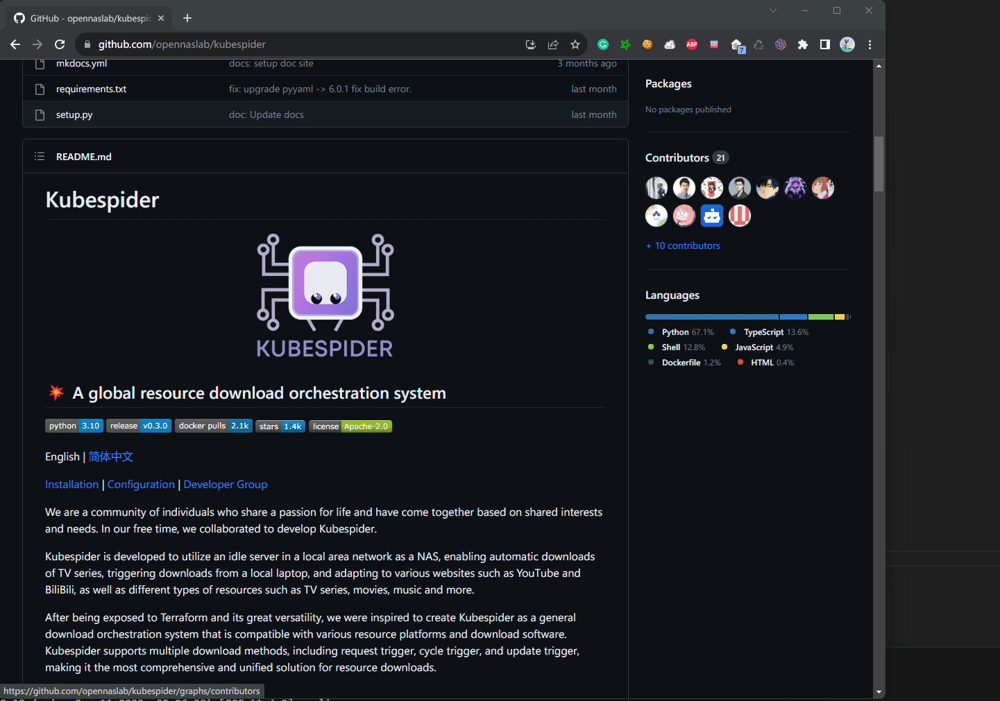
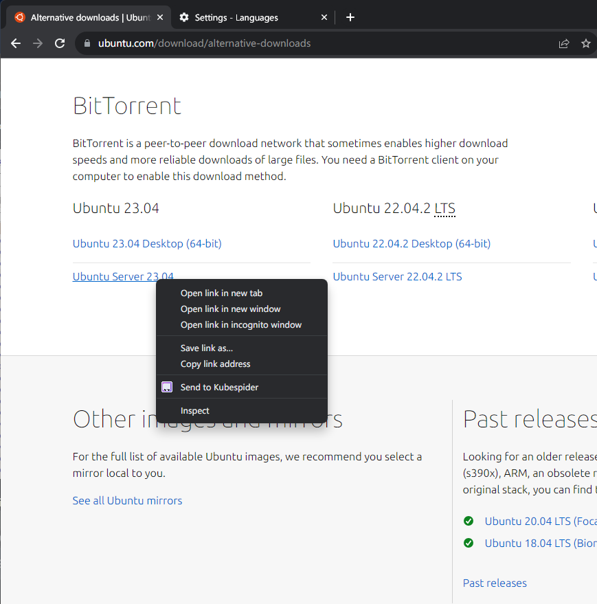
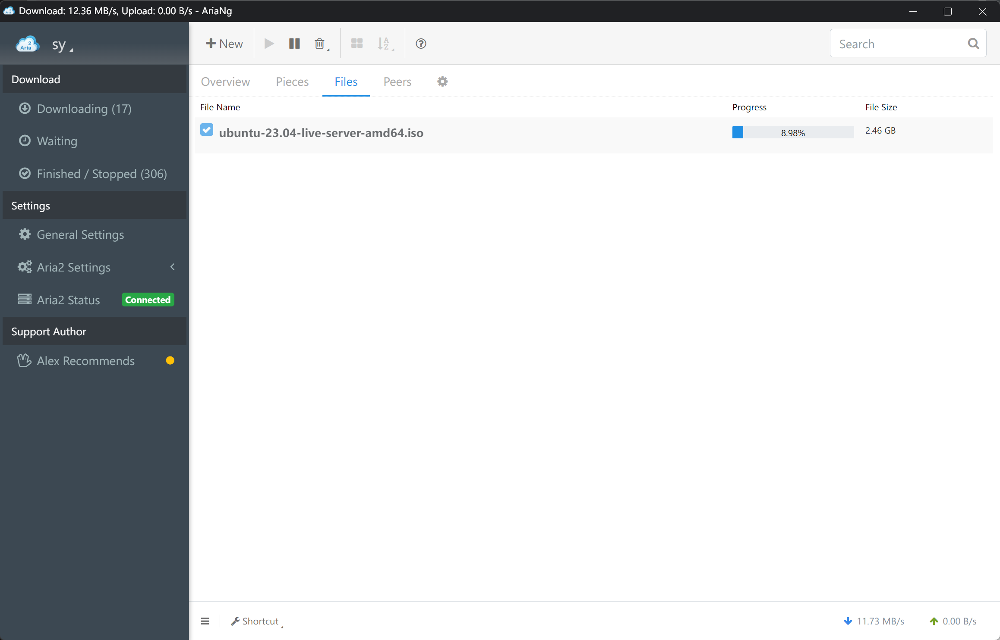

# Kubespider绿联NAS安装手册

## 场景
对于NAS玩家，或多或少都有资源下载需求，包括但不限于：

- 自动下载更新的TV/Movie/文件/其他，方便后续个人学习使用。
- 有一个大型文件或各式各样的文件下载，希望能方便的触发NAS机器下载。
- 自定义条件，自动触发下载相关资源，如自动下载豆瓣评分大于8的资源。
- 在某些资源网站上，有下载需求，如B站，YouTube，抖音等各种资源网站，供个人学习使用。
- 入门/资深资源网站玩家，需要对自己的账号维护，如自动刷上传下载量。

如果你有这些需求，那么Kubespider就是你要找的All-in-one的资源下载系统，打造属于自己的家庭NAS下载中心。

<!-- 安装步骤 -->
## 安装步骤

### 安装Docker套件

`Kubespider`使用Docker安装部署，需要安装Docker套件。绿联NAS原生支持Docker，并且安装十分方便。进入绿联云应用，打开应用中心，寻找Docker的应用，根据引导启用Docker。

<image src="./images/install-docker.png" alt="安装Docker">  


### 安装目录

通过 `文件管理` 应用，选择对应硬盘并创建对应的文件夹。

此例中，在 `hhd1` 下，创建了 `kubespider/aria2` 和 `kubespider/nas` 目录。

<image src="./images/create-dir.png" alt="安装目录">

### 导入镜像

按照如下步骤导入镜像 `cesign/kubespider:latest` 和 `cesign/aria2-pro:latest`。

<image src="./images/import-image.png" alt="导入镜像">

### 安装 Aria2

按照如下步骤创建 aria 容器：

<image src="./images/aria-1.png" alt="aria-1">

<image src="./images/aria-2.png" alt="aria-2">

注意修改网络名称为 `host`
<image src="./images/aria-3.png" alt="aria-3">

文件夹修改为之前创建的目录，类型改为读写
<image src="./images/aria-4.png" alt="aria-4">

绿联NAS 6800 端口已使用，修改为 6801
<image src="./images/aria-5.png" alt="aria-5">

修改环境变量 `RPC_PORT` 和 `RPC_SECRET`
<image src="./images/aria-6.png" alt="aria-5">


### 安装 Kubespider

参考安装 `Aria2` 创建 `Kubespider` 容器

<image src="./images/kubespider-1.png" alt="kubespider-1">

容器启动后，需要修改 `download_provider.yaml` 中 `Aria2` 的配置

通过文件管理，将 `download_provider.yaml` 下载到本地修改 `rpc_endpoint_port` 的值为 `6801`，再上传至原文件夹中替换原文件。

```yaml
aria2:
  type: aria2_download_provider
  enable: true
  download_base_path: "/downloads/"
  rpc_endpoint_host: http://127.0.0.1
  rpc_endpoint_port: 6801
  secret: kubespider
  priority: 2
```

### 安装浏览器插件
为了方便下载浏览器中的资源，我们提供了一个浏览器插件，目前仅支持chromium内核的浏览器

#### 安装Aria2插件

为了便于查看下载任务，需要下载Chrome插件AriNg:
- 如果你能访问外网，在chrome商店下载[AriaNg](https://chrome.google.com/webstore/detail/aria2-for-chrome/mpkodccbngfoacfalldjimigbofkhgjn)。
- 如果不能，在Crx4Chrome下载[AriaNg](https://www.crx4chrome.com/crx/85196/)。  

然后连接，插件配置如下(显示在脚本`install_kubespider.sh`执行输出最后)：


#### 安装Kubespider Chrome插件

Kubespider结合chrome插件，能获得更好的体验。

1. 按照如下步骤下载代码

    通过浏览器打开 `https://github.com/opennaslab/kubespider/archive/refs/heads/main.zip`，并将  `kubespider-main.zip` 解压。
    

2. 打开Chrome，按如下步骤安装Kubespider Chrome插件并且设置(其中地址为`http://<server_ip>:3080`)

    

3. 例如，我想要下载一个torrent的大文件，直接右键，发送给Kubespider即可([示例网站](https://ubuntu.com/download/alternative-downloads))
    

4. 使用aria2 Chrome插件查看下载任务，你可以看见下载任务已开始
    
    

### 浏览器一键下载演示

如果您看到这一章节，这说明已经成功安装完`Kubespider`了，并且配置好了一个基本的下载器！此时可以通过浏览器插件与`Kubespider`进行交互下载文件了

首先配置浏览器设置，安装第五章节安装好浏览器插件后，点击插件，在第二个选项中输入`Kubespider`的地址也就是nas的IP地址以及端口号，默认为3080，点击确认，如果一切正常则会提示`OK`

以 大型文件Ubuntu镜像 为例，打开[下载页面](https://ubuntu.com/download/desktop/thank-you?version=22.04.3&architecture=amd64)，在 `download now` 右键选择 `Send to Kubespider`:


如果一切正常则浏览器插件图标会提示`OK`字段，现在查看Aria2插件，即可看见触发下载的任务，此操作即可让NAS后台下载大型文件：

<image src="./images/download.png" alt="演示动画" height="300px">

下载完成后，可在如下图所示地址，找到下载文件。

<image src="./images/ubuntu.png" alt="演示动画" height="300px">

这里只给最简单下载演示，更多下载场景，请看项目 [README](https://github.com/opennaslab/kubespider/blob/main/README-CN.md#-%E7%89%B9%E6%80%A7%E5%88%97%E8%A1%A8)。
