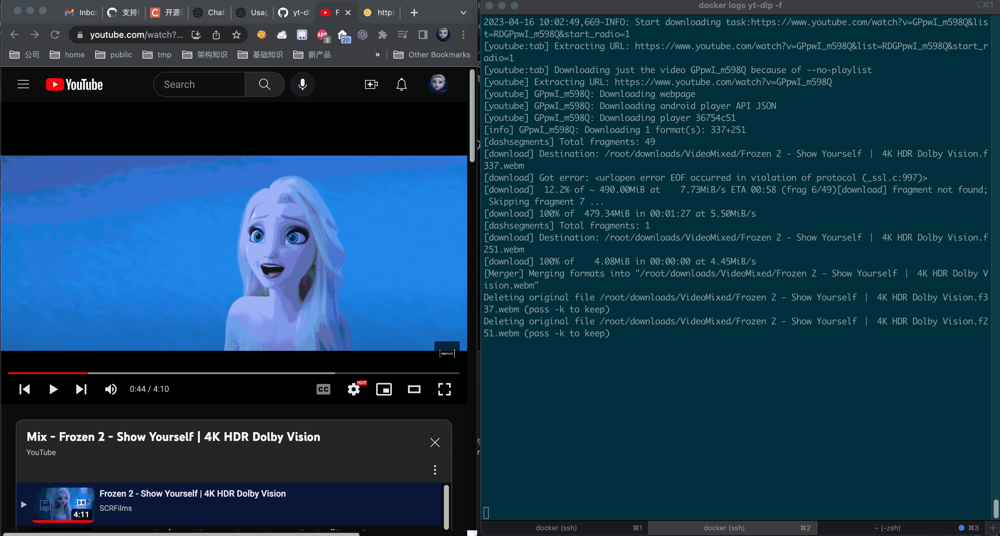

# yt-dlp下载提供器安装和配置
## 简介
[yt-dlp](hhttps://github.com/yt-dlp/yt-dlp) 是一个开源的命令行工具，用于从互联网上下载视频、音频和其他类型的媒体资源。  

## 最终效果
效果如图，结合yt-dlp，Kubespider会调用yt-dlp，下载YouTube视频：


## 安装
### 1.安装yt-dlp下载器
运行如下命令即可（如果你在中国大陆，记得在运行前设置环境变量`http_proxy`）：
```sh
git clone https://github.com/jwcesign/kubespider.git
cd kubespider
bash hack/install_ytdlp.sh
```

### 2.确认安装

运行如下命令，确认yt-dlp已经安装成功：
```sh
docker ps | grep yt-dlp
```
输出类似：
```sh
5eaf9caf8e45   cesign/ytdlp-downloader:latest      "python3 /root/app/a…"   4 hours ago    Up 3 hours
```

## 配置
### 1.Kubespider对接配置（可选）
#### 1.设置download_provider文件
配置文件如下：
```yaml
yt-dlp:
  type: ytdlp_download_provider
  enable: false
  http_endpoint_host: http://127.0.0.1
  http_endpoint_port: 3082
  priority: 0
```
其中：  
* `yt-dlp`: 名称，可自定义（不可重复），可以在 `source_provider.yaml` 中按名称指定下载器，此处示例为 yt-dlp。
* `type`: 表示此下载器的类型，需为 `ytdlp_download_provider`。
* `enable`: 设置是否使用此provider，只能使用一个，后续开发优先级后可以多个一起使用。
* `http_endpoint_host`: qbittorrent服务所在服务器地址。
* `http_endpoint_port`: qbittorrent的API服务端口，默认8080。
* `priority`: 下载提供器优先级，数字越小，优先级越高，下载资源时按优先级尝试，无法下载或下载失败时切换下载器。

#### 2.测试下载
配置好后，运行如下命令：
```
docker restart kubespider
```
按最终效果图测试一下即可。
